# Security Analytics Platform

This project is a comprehensive web application built with Django, SQLite, and machine learning, focusing on security analytics, including cryptography, steganography, phishing detection, and secure file handling. The platform provides tools for encryption, decryption, steganography, URL phishing detection, and interactive blog functionalities for sharing and discussing security topics.

## Features

### 1. Cryptography & Encryption
The platform supports encryption and decryption of files and messages using cryptographic algorithms to ensure data security.

- **Screenshot**:  
  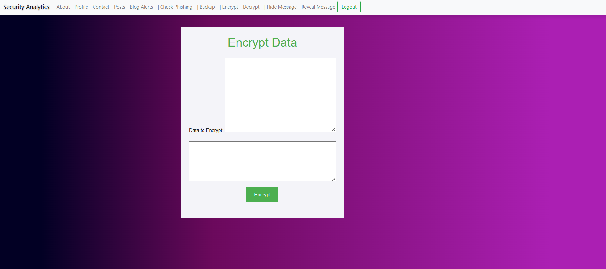

### 2. Steganography & Decryption
Users can hide data within images using steganography, and the system also provides the option to decrypt hidden data.

- **Screenshot**:  
  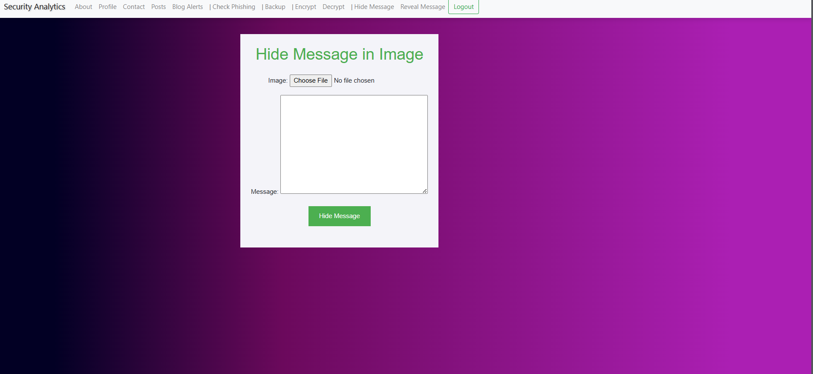
  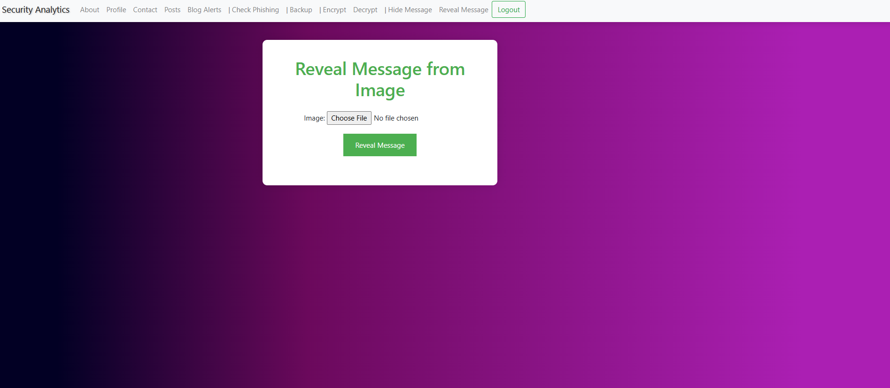

### 3. URL Phishing Detection
The platform includes a machine learning-based tool to detect phishing URLs. Users can input URLs, and the system will analyze and predict if the URL is malicious or safe.

- **Screenshot**:  
  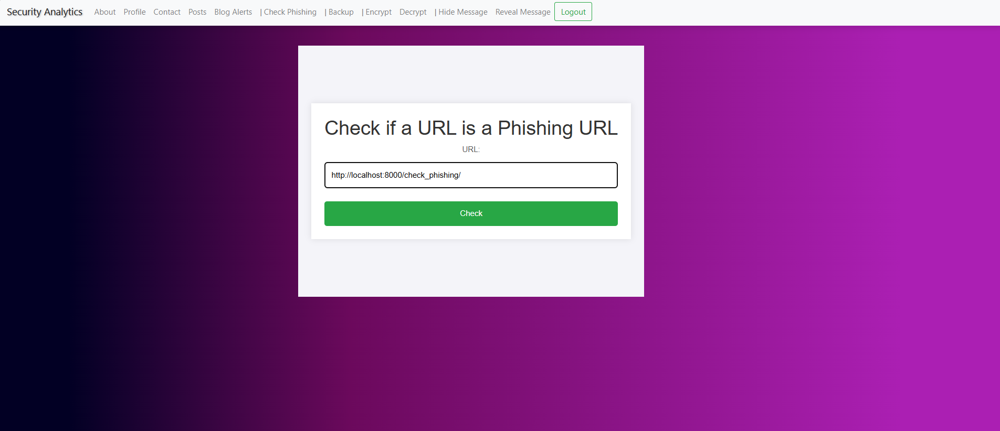
  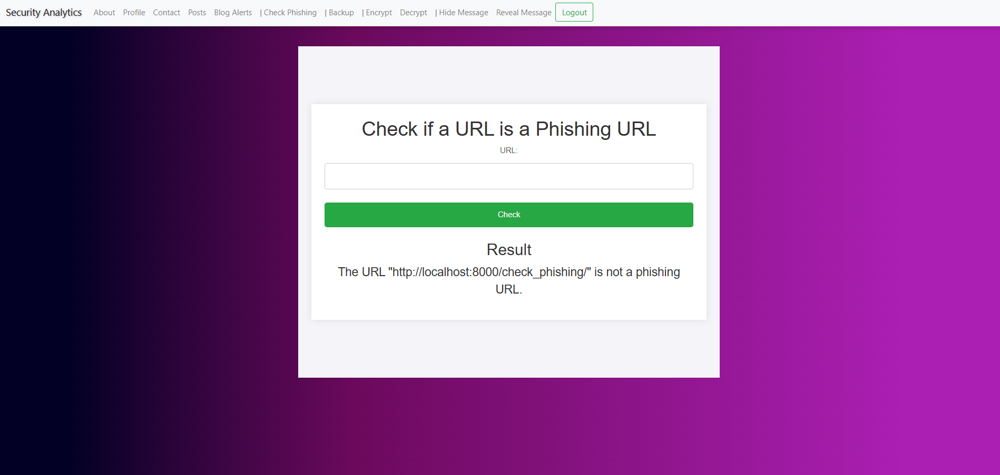

### 4. Blog Functionality
Users can create blog posts related to security topics, download posts, get notifications from authors, and share, like, or comment on posts. This feature promotes discussions and knowledge sharing in the community.

- **Screenshots**:  
  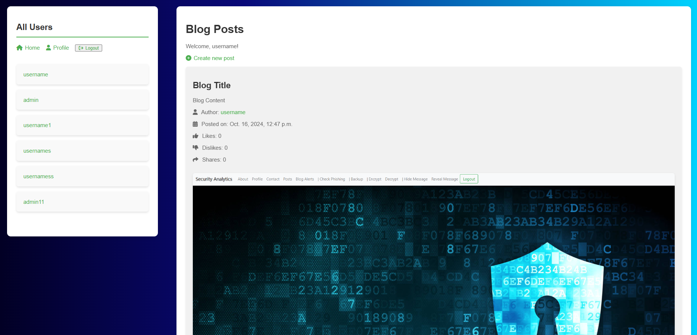
  
  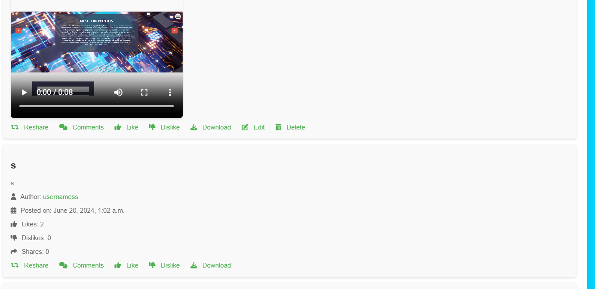

### 5. Profile Management
Users can manage their profile, track their activities, and customize their settings.

- **Screenshot**:  
  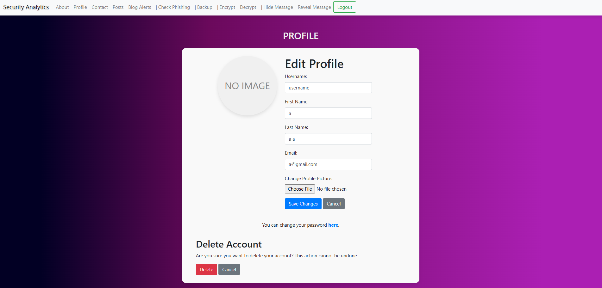

### 6. About Page
The application also provides an about page that details the project’s purpose, features, and security techniques used.

- **Screenshot**:  
  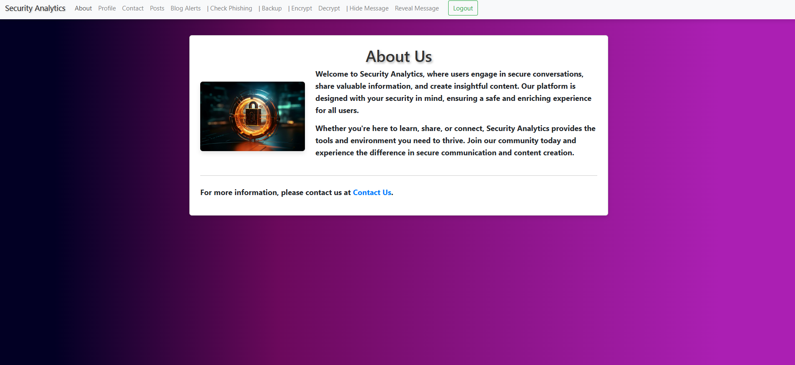

### 7. Home Page
The homepage provides an overview of the platform’s features and allows users to navigate easily through the application.

- **Screenshot**:  
  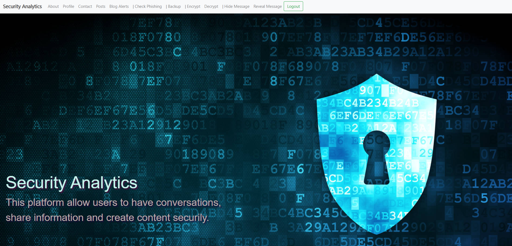

## Technologies Used

- **Django**: Web framework for backend development.
- **SQLite**: Database for storing user information, blog posts, and security data.
- **Machine Learning**: Used for phishing detection and other security analytics.
- **Cryptography**: Implements encryption and decryption algorithms for secure data handling.

## Installation

Follow these steps to set up and run the project locally:

1. **Clone the repository:**

   ```bash
   git clone <repository-url>
   ```

2. **Install the required dependencies:**

   ```bash
   pip install -r requirements.txt
   ```

3. **Run database migrations:**

   ```bash
   python manage.py migrate
   ```

4. **Start the Django development server:**

   ```bash
   python manage.py runserver
   ```

5. **Access the application:**

   Open your browser and go to `http://127.0.0.1:8000/` to use the platform.

## Usage

- **Encryption/Decryption**: Encrypt sensitive data or decrypt previously encrypted files/messages.
- **Steganography**: Hide information inside images and retrieve it later using decryption methods.
- **Phishing Detection**: Input URLs for analysis and get real-time feedback on potential phishing risks.
- **Blog Interaction**: Create security-related blog posts, comment, like, share, and download posts. Authors receive notifications when their posts are interacted with.
- **Profile Management**: Keep track of your activities, edit your profile, and manage security settings.

## Screenshots

- **About Page**  
  

- **Blog Page**  
  

- **Download & Notify Author**  
  

- **Cryptography & Encryption**  
  

- **Steganography Decryption**  
  

- **Decryption**  
  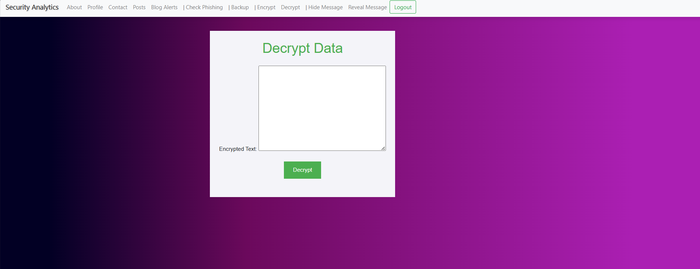

- **Homepage**  
  

- **Profile Page**  
  

- **Reshare, Like, Comment**  
  

- **Steganography**  
  

- **URL Phishing Detection**  
  

- **Phishing Detection Result**  
  

